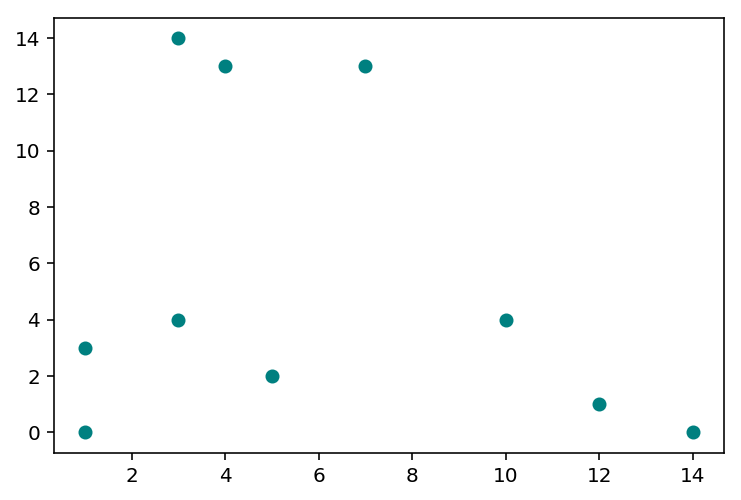
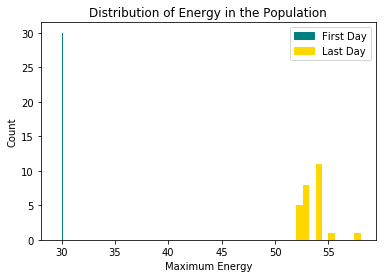
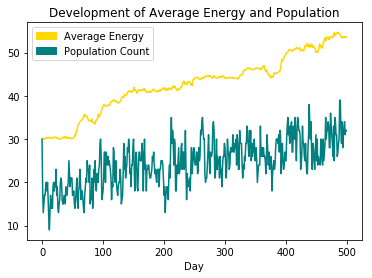
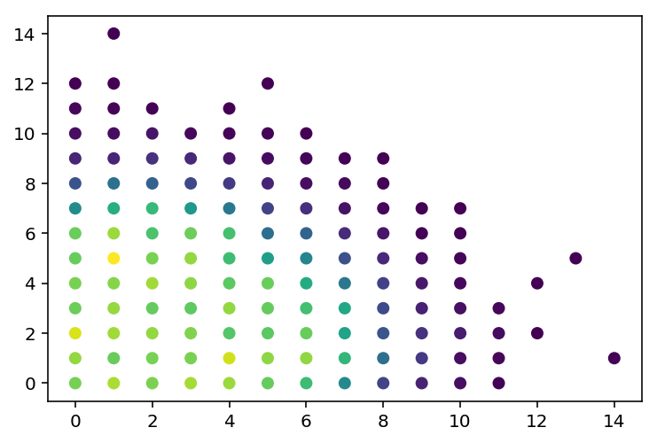

# Population Simulation

### Introduction
I have just started to learn Python over the past couple of weeks and I decided that I needed a project to start applying the knowledge I've learnt over various datacamp courses. I recently watched [this](https://www.youtube.com/watch?v=0ZGbIKd0XrM) very interesting video where the creator simulates a natural selection process within a population. I decided I would try and build something similar in Python as my first stab at the language. I would recommend you watch the mentioned video before continuing as it's:
1. very interesting and
2. much more sophisticated than what I build here.

### Outlining the Build
We're going to be simulating days in the lives of our population. Our population live on a 15 x 15 square world and have one task and one task only in their lives, eat food. Food will grow at the beginning of each day but does not last long, it will decompose at the end of the day. Our population will start each day at camp located at the origin (0,0). From here they will go out foraging for food each day.  

### Eating the Food
As mentioned, food spawns at the beginning of each day at random locations on the map. To eat the food an individual simply needs to land on the same square as that piece of food.

Each individual has a set amount of energy for the day and moving around will deplete energy. If an individual runs out of energy for the day before finding any food to eat then they will (sadly) die.

However if an individual does happen to find something to eat they will: consume the piece of food (so that it cannot be "eaten again"), return to camp safely without worry about energy, and finally reproduce to create an offspring.

### Randomness
To make this whole build worthwhile we need to add a bit of randomness, this is the genetic mutation within individuals that we can observe changing over the lifetime of our population. We will be adding some genetic diversity to the individual's energy levels. This will be implemented by occassionally adding or subtracting 1 to the energy level of each new individual in the population as they are created by our reproduction process. This way the energy level of the offspring is dependant on the parent's energy level.

### Summary
In summary, we're doing the following:

1. Spawning an initial population with given energy levels;
2. Growing f pieces of food in random locations each day;
3. Having the individuals go out and look for food each day;
4. Killing off individuals who do not find food before their energy runs out;
5. Creating offspring from individuals who do find food that day;
6. Adding genetic diversity to these offspring.

### Let's Start Coding
Now that we've got the outline summarised, we can start coding. Let's begin!

#### Packages
Our first step is to import the packages that we need to use:


```python
import random
import matplotlib.pyplot as plt
import matplotlib.patches as mpatches
import matplotlib.cm as cm
```

* random is used to generate random numbers for movement and apply the randomness to the energy level of offspring.
* matplotlib.pyplot and matplotlib.patches are used for plotting our outputs.

#### Dictionary and Population Creation
Now, I might be using some horrible practice here that Python folk will frown at me for but the use of a dictionary for referencing purposes throughout the code seems sensible enough to me. I create the following dictionary:


```python
ind_info = {
        "name":0,
        "x_pos": 1,
        "y_pos":2,
        "max_energy":3,
        "curr_energy":4,
        "speed":5,
        "eaten":6,
        "control":7}
```

Then I create the following function that allows me to spawn my population as a nested list of lists:


```python
def spawnPopulation(popSize, me):
    """ Spawns a population as a nested list of lists. """
    name = list(range(popSize))
    x_pos = [0] * popSize
    y_pos = [0] * popSize
    max_energy = [me] * popSize # <- to be kept constant
    curr_energy = max_energy[:] # <- to be updated as the individual moves
    speed = [1] * popSize
    eaten = [0] * popSize # <- indicate whether the individual has eaten
    control = [me] * popSize # <- measures whether energy just goes up because of the lower bound
    # Pull together our population using zip()
    population_zip = zip(name, x_pos, y_pos, max_energy, curr_energy, speed, eaten, control)

    # And create a list of nested lists
    population = [list(l) for l in population_zip]

    #print("COMPLETED - SPAWNING POPULATION")
    
    return(population)
```

As mentioned this function creates a population as a nested list of lists. Each list within the list contains information on a specific individual. It contains:
* **name**: An integer index that allows us to identify individuals;
* **x_pos**: The x coordinate of the individual's current position;
* **y_pos**: The y coordinate of the individual's current position;
* **max_energy**: The maximum energy of the individual, this is the amount of energy that the individual will start each day with;
* **curr_energy**: The current energy level of the individual. This will decrease as the individual moves around. NOTE: this will never be greater than the individual's maximum energy;
* **speed**: Indicates how many squares the individual can move each turn. This is currently not used but is in place to allow further development of the build;
* **eaten**: A binary value to indicate whether the individual has eaten this day or not;
* **control**: Not sure what this is? (SEE WHERE THIS IS USED!)

We can then use the dictionary approach to reference these specific pieces of information by name rather than by index. If we spawn a population of size 10, with maximum energy of 10 we get the following:


```python
population = spawnPopulation(10, 10)
print(population)
```

    [[0, 0, 0, 10, 10, 1, 0, 10], [1, 0, 0, 10, 10, 1, 0, 10], [2, 0, 0, 10, 10, 1, 0, 10], [3, 0, 0, 10, 10, 1, 0, 10], [4, 0, 0, 10, 10, 1, 0, 10], [5, 0, 0, 10, 10, 1, 0, 10], [6, 0, 0, 10, 10, 1, 0, 10], [7, 0, 0, 10, 10, 1, 0, 10], [8, 0, 0, 10, 10, 1, 0, 10], [9, 0, 0, 10, 10, 1, 0, 10]]
    

If we then want to reference the current x coordinate of our first individual (let's say) we simply write the following:


```python
xcoord = population[0][ind_info["x_pos"]]
print(xcoord)
```

    0
    

Now that we've got our initial population let's move on to moving, get it?

#### Moving our Individuals
To move our individuals we create a move() function. This function moves each individaul one square in a random direction and decreases the current energy level of the individaul accordingly. We assume our individuals have no common sense and that their movement is random; they will even move back to the square they were JUST on despite knowing that there is no food there.

Also if an individual tries to move off the map then they will simply turn around 180 degrees and move in the other direction. Here's the function:


```python
def move(population):
    """ Moves our individuals in a random direction and then reduces their energy
    by 1. This function takes the population list as an argument. """            

    # For each individual we determine an axis to move on and a direction to move:
    # Initialize empty lists:
    axis = []
    direction = []

    # Loop through the population:
    for i in range(len(population)):
        axis.append(random.randint(1,2)) # <- randomize 1 or 2 and use this as an indexed references
        if random.randint(0,1) == 1: # <- This if-else clause is probably not the best method
            direction.append(1)
        else:
            direction.append(-1)

    # Now use these to update population and 'move' our individuals!
    for i in range(len(population)):
        
        # Only move individuals who have not eaten this round and who still have energy:
        if population[i][ind_info["eaten"]] == 0 and population[i][ind_info["curr_energy"]] > 0:
            population[i][axis[i]] = population[i][axis[i]] + direction[i] 
        
            # We also need to reduce the energy of our individuals.
            # We can use our dictionary ind_info to reference the positions!
            # This means we can reference specific charactersistics of our individuals
            # without using ugly indexes (and getting all confused when we come back to
            # look at our code)!
            population[i][ind_info["curr_energy"]] = population[i][ind_info["curr_energy"]] - 1
    
    # Dirty fix for this movement off the map
    # We say that any creature that tries to move "off" the map, moves on the same axis
    # but turns around and moves the other way. That way we can fix it by just adding 2
    # to any x or y values that are less than zero.
    for i in range(len(population)):
        if population[i][ind_info["x_pos"]] < 0:
            population[i][ind_info["x_pos"]] = population[i][ind_info["x_pos"]] + 2
            
        if population[i][ind_info["y_pos"]] < 0:
            population[i][ind_info["y_pos"]] = population[i][ind_info["y_pos"]] + 2
  
    #print("COMPLETED - MOVING POPULATION")    
    
    return(population)
```

#### Growing Food
We need a function to grow the food at the start of each day. This function randomly generates n (x,y) coordiate pairs across our 15 x 15 grid:


```python
def growFood(foodCount, mapSize):
    """ Samples x and y coordinates within the range of the map and then 
    uses these value to create tuples to act as coordinates for food """
    food_x = []
    food_y = []
    
    for i in range(foodCount):
        food_x.append(int(random.uniform(0, mapSize + 1)))
        food_y.append(int(random.uniform(0, mapSize + 1)))

    food_zip = zip(food_x, food_y)
    
    food = [list(l) for l in food_zip]
    
    # Give a visual of where our food has grown:
    # plt.scatter(*zip(*food), color = "green")
    # plt.show()

    #print("COMPLETED - GROWING FOOD")

    return(food)
```

Let's grow some food and plot it to see what it looks like:


```python
%config InlineBackend.figure_format = 'retina' # Creates much nicer looking plots

food = growFood(10, 15)
plt.scatter(x = list(zip(*food))[0], 
            y = list(zip(*food))[1],
            color = "teal")
plt.show();
```





Now that we've got a function to grow our food we need our individuals to be able to eat it!

### Eating Food
The eatFood() function cycles through each individual and each piece of food and compares the (x,y) location. If there is a match then it removes the food from the food list and changes the eaten status of the individual. It also reduces the individual to 0 for looping purposes:


```python
def eatFood(p, f):
    """ Loops through the population to get the (x,y) loc for each individaul and
    compares them to the (x,y) locations of all the remaining food. If there is a match
    then the food is eaten (removed from the food list) and the eaten status of the
    individual is updated. """
    
    for i in range(len(p)):
        
        # Skip any individuals who have already eaten this round:
        if p[i][ind_info["eaten"]] == 1:
            continue
        
        # Now for individuals who have not yet eaten:
        xloc = p[i][ind_info["x_pos"]] # <- get x location of current individual
        yloc = p[i][ind_info["y_pos"]] # <- get y location of current individual
        loc = [xloc, yloc] # <- combine to create a complete location
    
        # Now loop through each piece of food to see if we get a match
        for j in range(len(f)):
            if loc == f[j]:
                p[i][ind_info["eaten"]] = 1 # <- update the eaten status for the individual
                p[i][ind_info["curr_energy"]] = 0 # <- reduce energy to 0 as its not needed
                
                # Add location to eaten_loc[] list:
                global eaten_loc
                eaten_loc.append(f[j])
                
                del(f[j]) # <- remove the food from the map
                break
    # Update the global list
    global population
    population = p
    # Update the global food list
    global food
    food = f

    #print("COMPLETED - EATING FOOD")
```

Nice, we're almost there. The next step is creating a function that kills off individuals who did not manage to eat on a specific day.

### Killing Individuals
The sad part, this function checks the current energy level and eaten status of each individual. If they are both equal to 0, then the individual is removed from the population:


```python
def killIndividuals(p):
    """ Deletes any individuals who are both out of energy and did not find food
    to eat this round. """
    
    # Initialize our death records
    death_records = []
    
    for i in range(len(p)):
                
        # Check if the individual is out of energy AND has not eaten this round:
        if p[i][ind_info["curr_energy"]] == 0 and p[i][ind_info["eaten"]] == 0:
            death_records.append(i) # <- if so, add this individual to the death records    

    # Figure out who the survivors are via the death records:
    survivors = set(range(len(p))).difference(death_records)
    
    # Update the global population list:
    global population
    population = [p[s] for s in survivors]
```

### Returning to Camp
We also need a function that gets our individuals back to camp if they've eaten. This resets the x position to 0, the y position to 0, the current energy level back to the maximum energy level and the eaten status back to 0 (hasn't eaten):


```python
def returnToCamp(p):
    """ Resets the (x,y) position, energy level and eaten status of the population. """

    for i in range(len(p)):
        p[i][ind_info["curr_energy"]] = p[i][ind_info["max_energy"]] 
        p[i][ind_info["x_pos"]] = 0 
        p[i][ind_info["y_pos"]] = 0
        p[i][ind_info["eaten"]] = 0
            
    return(p)
```

#### Reproduction
And the very last step, coding the creation of offpsring. We start by creating a mutation() function that adds variation to the maximum energy of the offspring:


```python
def mutate(c):
    
    # Mutate maximum energy:
    mutation_result = random.uniform(0,1)
    
    if mutation_result < 0.1:
        c[ind_info["max_energy"]] = c[ind_info["max_energy"]] - 1
    
    if mutation_result > 0.9:
        c[ind_info["max_energy"]] = c[ind_info["max_energy"]] + 1
        
    return(c)
```

And we also create a reproduce() function that checks to see if an individual has eaten, and then creates a new individual in the population by using the current individual's information. It also uses the mutate() function that we just created to add some genetic diversity:


```python
def reproduce(p):
        
    global population_records
    # Initialize our birth records:
    birth_records = []
    
    # loop through each individual
    for i in range(len(p)):
        # check if the individual has eaten:
        if p[i][ind_info["eaten"]] == 1:
            # if so, create a replica:
            child = p[i][:]
            
            # mutate:
            child = mutate(child)
            
            # update the name:
            child[ind_info["name"]] = population_records[-1] + 1
            # and update the population records
            population_records.append(population_records[-1] + 1)
            # add child to the population
            birth_records.append(child)
            
    # Add new births to population:
    p = p + birth_records
    # Print our completion message:
    #print("COMPLETED - REPRODUCTION")
    # Finally return our new population:
    return(p)
```

Great, now we've got everything we need to get going.

### Running our Simulation
Let's give ourselves some parameters to set up our simulation. We'll use a grid size of 15 x 15, an initial population size of 30, a starting maximum energy of 30 for individuals, a food count of 100 pieces of food each day and we'll run the simulation for 500 days:


```python
kMapSize = 15 
kPopSize = 30
kStartingEnergy = 30
kFoodCount = 100
kDays = 500
```

#### Spawning the Population
We can now spawn our population. We alos create a replica that remains unchanged through the simulation. We can use this to compare to the final population to see how the natural selection process works:


```python
population = spawnPopulation(kPopSize, kStartingEnergy)
initial_population = population[:]
```

#### Trackers
We generate our birth records, used to track the population:


```python
population_records = list(range(kPopSize))
```

We also initialize some empty lists used for tracking: 
* **average_energy** to track the average energy of the population each day; 
* **pop_count** to track the size of our population each day;
* **eaten_loc** to track the frequency that food is being eaten at each location in the world.


```python
average_energy = []
pop_count = []
eaten_loc = []
```

#### Simulating
Now we put all our functions together and let it go:


```python
for days in range(kDays):
    
    # Keep a tracker of how the energy progress through the days
    average_energy.append(sum(list(zip(*population))[ind_info["max_energy"]]) / len(population))
    pop_count.append(len(population))
    # Give the user an output of what day we're on:
    # print(days) # <- print of days used for testing
    
    # Reproduce!
    population = reproduce(p = population)

    # Return to camp
    population = returnToCamp(p = population)
    
    # Grow Food
    food = growFood(kFoodCount, kMapSize)
    
    # Only run while individuals still have energy AND food still exists
    while sum(list(zip(*population))[ind_info["curr_energy"]]) > 0 and len(food) > 0:
    
        # Move population
        population = move(population)
    
        # Eat food
        eatFood(p = population, f = food)          
    
    # Kill 0 energy individuals
    killIndividuals(p = population)
```

### Outputs

#### Distribution of Energy
We can use a histogram to examine how the distribution of maximum energy of individuals has changed from the population at day 1 to the population at the final day:


```python
# Create custom legend entries for energy levels on the first and last day of the simulation
plot_legend_first = mpatches.Patch(color = 'teal', label = 'First Day')
plot_legend_last = mpatches.Patch(color = 'gold', label = 'Last Day')
# Plot the distribution of energy on the last day, color it blue:
plt.hist(list(zip(*population))[ind_info["max_energy"]], color = 'gold')           
# Add the distribution of energy on the first day, color it red:
plt.hist(list(zip(*initial_population))[ind_info["max_energy"]], color = "teal")
# Add the legend:
plt.legend(handles = [plot_legend_first, plot_legend_last])
# FInaly, add the axes labels and plot title:
plt.xlabel("Maximum Energy")
plt.ylabel("Count")
plt.title("Distribution of Energy in the Population")
plt.show();
```





As expected, the energy of individuals has increased over the days. Individuals with higher energy are more likely to find food before they become exhausted. They then reproduce and pass on their high energy genes!

#### Development of Energy and Population
We can also look at how the average energy and population count have developed over time:


```python
plot_legend_energy = mpatches.Patch(color = "gold", label = "Average Energy")
plot_legend_population = mpatches.Patch(color = "teal", label = "Population Count")

plt.plot(average_energy, color = "gold")
plt.plot(pop_count, color = "teal")

plt.legend(handles = [plot_legend_energy, plot_legend_population])

plt.xlabel("Day")
plt.title("Development of Average Energy and Population")
plt.show();
```





The energy line is consistent with the histogram from before. Interestingly the population plummits initially and then gradually climbs up. The volatile shape of the population line is due to the way reproduction takes place.

#### Eating Locations
We can also examine which areas in the world our individuals are most frequently eating. It will be interesting to see whether the food that grows near the top right of the world (away from the population's 'camp') is being eaten at all. We need to do a quick bit of summary work to allow us to use the colour of the dots to indicate the frequency of food consumed at each location:


```python
# We need to convert our nested list to a list of tuples for our below loop to work,
# we can't use a nest list as list objects are not "hashable".
eaten_loc_tuples = [tuple(l) for l in eaten_loc]

# Initialize an empty dictionary for locations. The keys will be the x,y locations and
# the values will be the frequency:
locs = {}

# Loop through each tuple in eaten_loc_tuples and if the tuple is a key in locs, add 1 to
# the frequency, if not, add a new key to locs and set the frequency to 1:
for x in eaten_loc_tuples:
    if x in locs.keys():
        locs[x] = locs[x] + 1
    else:
        locs[x] = 1

# We can use the same list(zip(*)) technique from before to grab elements from locs.
# We create some lists for our plot to make it easier to read:
x_axis = list(zip(*locs.keys()))[0]
y_axis = list(zip(*locs.keys()))[1]
colors = list(locs.values())

# set up a color map
colormap = cm.jet

# set up our colour bar
scalarmappaple = cm.ScalarMappable(cmap=colormap)
scalarmappaple.set_array(colors)

# And now we plot:
plt.scatter(x = x_axis, y = y_axis, c = colormap(colors))
plt.colorbar(scalarmappaple)
plt.title("Total Food Eaten at each Location")
plt.show()
```




